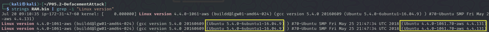
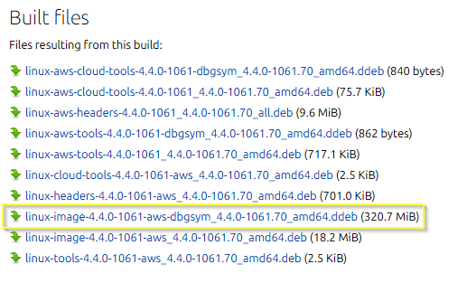

# Proyecto 5-2: Defacement Attack - Investigación

## Indice

1. [Descubrimiento y obtención del perfil de la memoria](#1-descubrimiento-y-obtención-del-perfil-de-la-memoria)
2. [Procesos](#2-procesos)  
   2.1. [Información general](#21-información-general)  
   2.2. [Procesos activos](#22-procesos-activos)  
   2.3. [Bash](#23-bash)  
   2.4. [Procesos sospechosos](#24-procesos-sospechosos)  
   2.5. [Red](#25-red)
3. [Línea de tiempo](#3-línea-de-tiempo)

## 1. Descubrimiento y obtención del perfil de la memoria

Al usar en comando `imageinfo` de volatility no he obtenido el perfil de la memoria, por lo que he tenido que importarlo manualmente. Para ello he seguido los siguientes pasos:

1. Obtener la version de Linux

   Usando el comando `strings` he podido ver que la version del sistema operativo es **Ubuntu 16.04.9** y la version del kernel es **4.4.0-1061-aws**.

   

2. Cargar el perfil

   En la siguiente [página](https://launchpad.net/~canonical-kernel-team/+archive/ubuntu/ppa/+build/14938851) he podido encontrar un perfil con las mismas características:

   

   Tras descargar y descomprimir el perfil, he usado la herramienta [dwarf2json](https://github.com/volatilityfoundation/dwarf2json.git) para importar el perfil a la herramienta Volatility 3.

## 2. Procesos

### 2.1. Información general

| Campo        | Valor                                    |
| ------------ | ---------------------------------------- |
| Tamaño       | 1.048.181 KB (1.048181 GB)               |
| Hash MD5     | e063c257d2f41ddee65ea1fdabe64e95         |
| Hash SHA1    | bc2ebb435e75b3406280a2967b1c2696fc3e160a |
| Modificación | 2018-09-14 16:03:48.000000000 +0200      |
| Acceso       | 2025-04-06 18:31:16.532877637 +0200      |
| Cambio       | 2025-04-06 18:31:16.496877637 +0200      |
| Creación     | 2025-04-06 18:30:26.440877166 +0200      |

### 2.2. Procesos activos

El archivo `output_PsList.json` contiene los la siguiente información:

- Proceso 9126 (bash): Instalación de Apache, MySQL, y Let's Encrypt.

- Proceso 27428 (apache2): Numerosas instancias hijas como son las instancias 5573 y 5763.

### 2.3. Bash

En el archivo `bash.txt` se ha encontrado la siguiente información:

- Configuración de Apache y SSL.
- Conexiones a MySQL remoto.

### 2.4. Procesos sospechosos

En el archivo `malfind.txt` se ha podido hallar la siguiente información:

- Procesos de Apache2 con permisos de lectura, escritura y ejecución en regiones como 0x7f0663ff3000.
- `Hexdump` muestra instrucciones de ensamblador no asociadas a Apache.

### 2.5. Red

En el archivo `ippadr.txt` se puede ver la siguiente información:

- IP: 172.31.47.60.
- Proceso 9055 perteneciente a una conexión SSH.

## 3. Línea de tiempo

| Fecha y hora            | Acontecimiento                                                                            |
| ----------------------- | ----------------------------------------------------------------------------------------- |
| 20/07/2018 09:10:25 UTC | Inicio del sistema                                                                        |
| 20/07/2018 10:04:02 UTC | Inicio del servicio de Apache2 web                                                        |
| 24/07/2018 05:24:19 UTC | Instalación de LiME, compilación del módulo del kernel y reconfiguración de Let's Encrypt |
| 24/07/2018 05:27:03 UTC | Memoria capturada usando LiME                                                             |

---

Hecho por Víctor Jiménez
